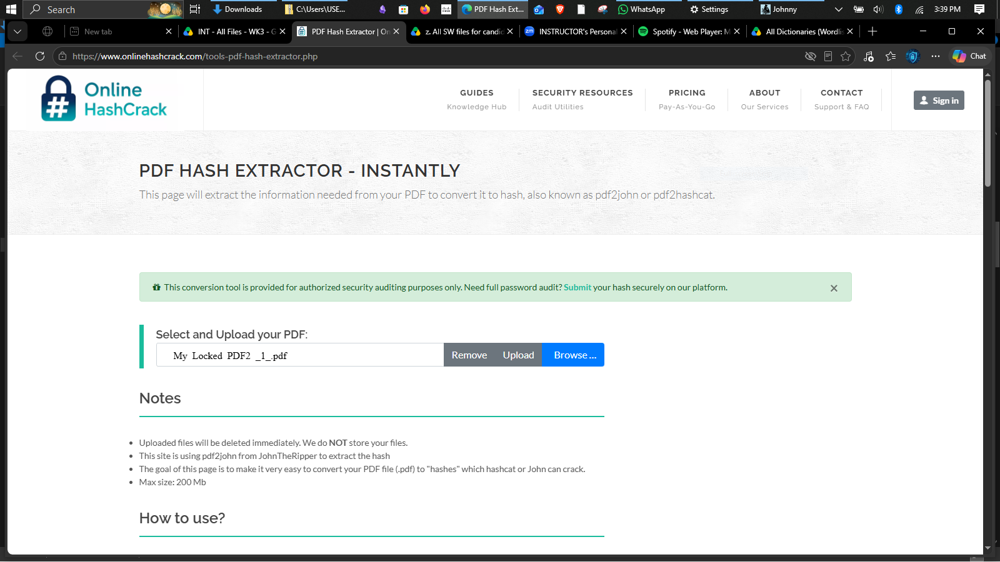
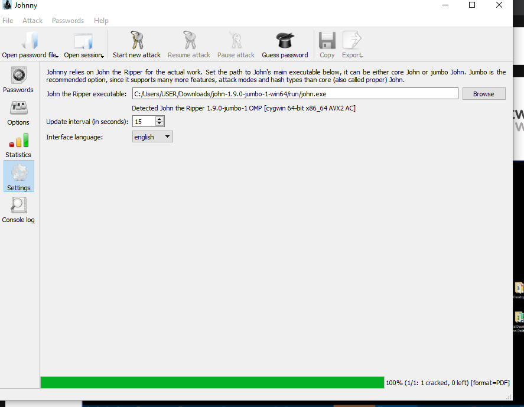
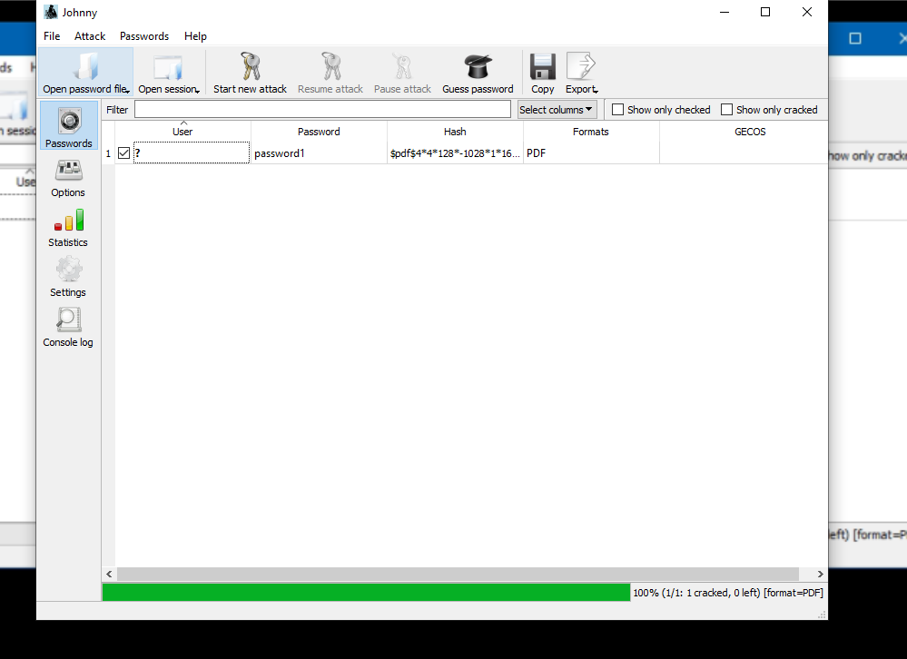
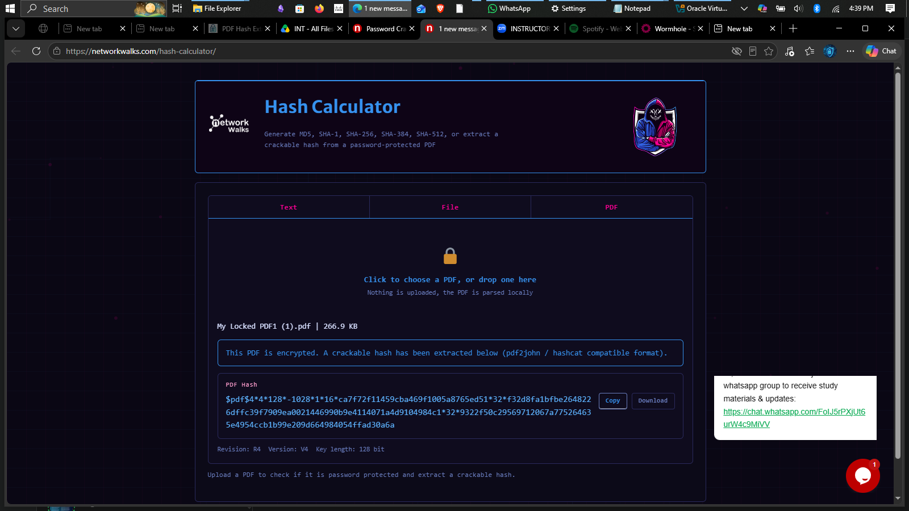
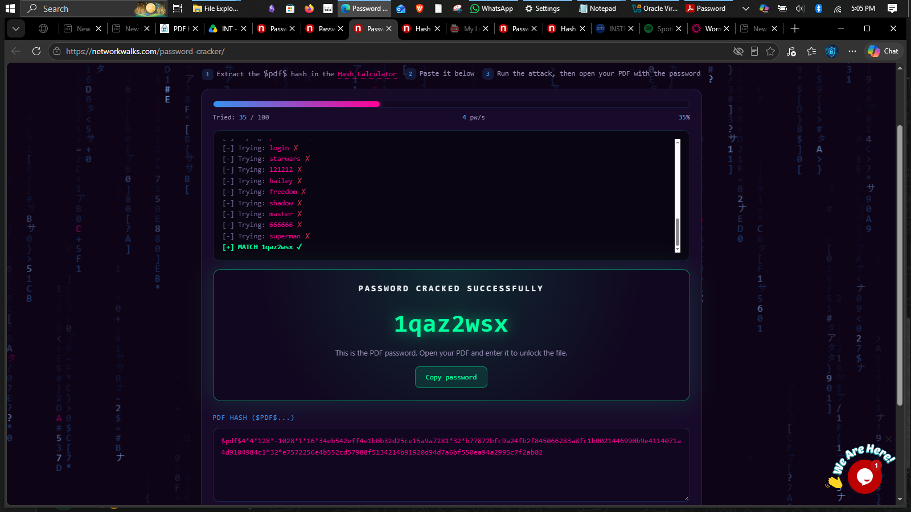

# 🔐 PDF PASSWORD CRACKING

## John the Ripper🕵️‍♂️ NetworkWalks Password Hash Calculator💻 NetworkWalks Password Cracker👨‍💻

## Cybersecurity Project Report

| Submitted by: | Qazeem Samshudeen Temitope |
| --- | --- |
| Program / Batch: | B083 – Networkwalks |
| Week: | 03 |
| Date: | 26-09-2026 |
| Instructor: | Waqas Karim (CCIE) |

---

# 1. Introduction

As part of my ongoing cybersecurity studies, I decided to build a practical lab around password cracking using John the Ripper and other related security tools.

My main goal for this project was to understand how people test password-protected PDF files to see if their passwords can be recovered, and to figure out how password hashes actually operate behind the scenes in security systems.

To get this done, I tested out tools like the OnlineHashCrack PDF Hash Extractor, Johnny GUI, John the Ripper, and a couple of NetworkWalks utilities. Getting my hands dirty with these tools gave me a much clearer picture of how hash extraction, analysis, and password recovery actually work in practice.

---

# 2. Project Objectives 🎯

I set out on this project with a few clear goals in mind:

* To wrap my head around the full workflow of password cracking and recovery.
* To learn how to pull out cryptographic password hashes straight from locked PDF files.
* To get comfortable using standard industry tools for password testing.
* To drill home why strong passwords matter and how to approach cybersecurity testing responsibly and ethically.

---

# 3. Tools and Technologies Used 🛠️

| Tool | Description |
| --- | --- |
| **OnlineHashCrack PDF Hash Extractor** | I used this online utility to pull the password hash structure out of my sample PDF file. |
| **John the Ripper** | The heavy-lifting command-line engine I used to run recovery attempts against the hash. |
| **Johnny GUI** | A handy graphical wrapper that made working with John the Ripper much easier visually. |
| **NetworkWalks Password Hash Calculator** | Used this to play around with how passwords get converted into different hash formats. |
| **NetworkWalks Password Cracker** | Tested this alongside my main workflow for extra practice with hash and password testing. |
| **GitHub** | Where I hosted my markdown documentation, screenshots, and project files. |

---

# 4. Project Implementation ⚙️

## 4.1 PDF Hash Extraction

I kicked things off by heading over to the OnlineHashCrack PDF Hash Extractor page. I uploaded my test PDF (which I had password-protected beforehand) and ran the extraction tool to grab its hash information.

The output gave me a specific hash format that standard tools like John the Ripper can read. Walking through this step showed me how security pros can pull necessary authentication data out of locked documents during authorized security assessments.

## 4.2 Loading the Hash into Johnny GUI

Once I had the hash copied, I opened up Johnny—which is the graphical interface for John the Ripper—and pasted the hash string right into it.

As you can see in the screenshot, the application neatly organizes the PDF entry and displays its hash details. Using this GUI made it super straightforward to move from command-line data to a clean visual setup before running any recovery tests.

## 4.3 Password Recovery Using John the Ripper

With the hash loaded up, I used John the Ripper (through the Johnny interface) to kick off password recovery testing.

The tool works by testing different candidate words or strings against the target hash to see if anything matches. How fast or successful this process is depends entirely on things like how complex the password is, the attack method used (like a wordlist or brute-force), and how much computing power you have available.

## 4.4 Password Hash Calculation Using NetworkWalks

I also spent some time playing with the NetworkWalks Password Hash Calculator to see how plain text strings transform into completely different hash outputs.

This exercise really helped cement the idea that hash algorithms spit out a fixed-length string no matter what you type in, which is why secure systems rely heavily on proper hashing and salting techniques to protect user accounts.

## 4.5 Password Cracker

To round things out, I checked out the NetworkWalks Password Cracker tool just to see another way security utilities handle credential and hash testing.

Comparing its behavior to John the Ripper gave me a broader look at how different platforms approach password strength evaluation.

---

# 5. Results and Observations 📊

Going through these steps from start to finish gave me a clear, end-to-end view of how document encryption breaks down into extractable hashes and graphical recovery testing.

The biggest takeaway for me was seeing firsthand just how quickly weak or short passwords fall apart under recovery tools, proving why strong, unique passwords and solid encryption standards are so vital for keeping sensitive files safe.

---

# 6. Challenges Faced and Solutions 💡

| Challenge | Solution / Learning |
| --- | --- |
| **Extracting the PDF hash** | Used the PDF Hash Extractor and took my time reading through the output syntax. |
| **Loading the hash into Johnny** | Double-checked the format of the extracted string before importing it into the GUI tool. |
| **Understanding hash output** | Used the hash calculator utility to figure out why different hash types look the way they do. |
| **Interpreting recovery results** | Looked closely at tool feedback to better understand password complexity rules and performance limits. |

Dealing with these small hurdles really helped boost my confidence and troubleshooting skills when handling security tools.

---

# 7. Learning Outcomes 📚

* Got a firm grasp on how password hash extraction and recovery workflows actually operate day-to-day.
* Learned how to bridge command-line powerhouses (**John the Ripper**) with friendly graphical front-ends (**Johnny GUI**).
* Connected the dots between abstract math/cryptography and real-world document security.
* Got better at organizing my screenshots, structuring technical notes, and publishing clean reports on GitHub.

---

# 8. Ethical Considerations and Security Recommendations 🛡️

* I kept everything strictly educational and made sure all testing was done safely within authorized limits.
* This project proved why individuals and companies need to enforce long, complex passwords and completely avoid reusing credentials across multiple websites.
* It also reminded me that handling sensitive hashes or recovered passwords is a serious responsibility—you should only ever test credentials when you have explicit permission to do so.

---

# 9. Conclusion

Wrapping up this password cracking project felt like a major milestone in my cybersecurity learning journey.

By combining tools like OnlineHashCrack, Johnny GUI, John the Ripper, and NetworkWalks, I gained practical insight into how authentication systems can fail and how security analysts test for those weaknesses. It was a great mix of technical execution and documentation practice, and it has me even more excited to dive deeper into ethical hacking and information security.

---

# 10. References

1. John the Ripper: [https://www.openwall.com/john/](https://www.openwall.com/john/)
2. OnlineHashCrack: [https://www.onlinehashcrack.com/](https://www.onlinehashcrack.com/)
3. NetworkWalks: [https://www.networkwalks.com/](https://www.networkwalks.com/)
4. Course materials and instructions provided by my instructor Mr. Waqas Karim (CCIE).
